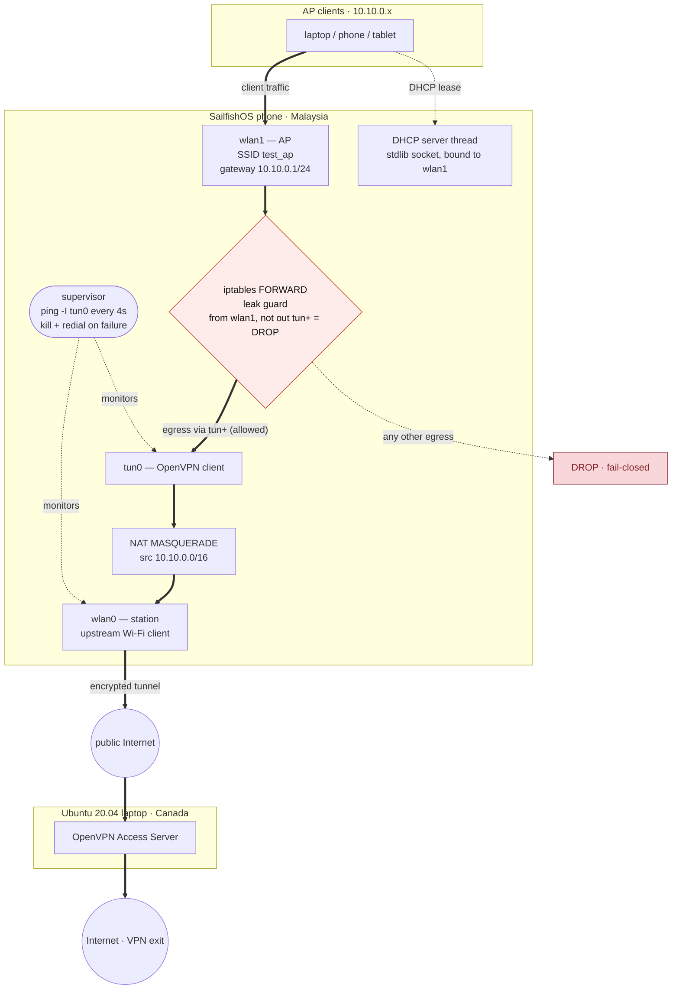

# SailfishOS Wi-Fi Access Point + VPN Travel Router

Turn a SailfishOS phone into a discreet Wi-Fi access point whose clients are routed exclusively through an OpenVPN tunnel — with a permanent, stateless **leak guard** (an always-on iptables rule) that prevents any AP client traffic from leaking outside the tunnel, even during VPN setup, outages, or reconnects. A background **supervisor** actively re-establishes the tunnel when upstream Wi-Fi drops, all driven from a live full-screen dashboard.


The phone's Wi-Fi chip is operated in concurrent station + AP mode. `wlan0` connects upstream as a normal client; a virtual `wlan1` interface is created on the same radio and runs in AP mode, broadcasting `test_ap` on the `10.10.0.0/24` subnet.

A small Python DHCP server hands out leases to AP clients. It is standard library only — a UDP socket plus `struct` — so there is no virtual environment and nothing to `pip install`. The socket is pinned to the AP interface with `SO_BINDTODEVICE`, so the server can only ever answer DISCOVERs arriving on `wlan1`; it will never respond on the upstream network you are attached to. It handles DISCOVER, REQUEST, DECLINE, RELEASE and INFORM; leases carry an expiry and are persisted to `/tmp/travelrouter/dhcp_leases.json`, so they survive a restart without handing out duplicates.

---

## Network topology

```
                    +------------------------+
   AP client  --->  | wlan1 (test_ap)        |  10.10.0.0/24
   (10.10.0.x)      |   |                    |
                    |   v                    |
                    | iptables FORWARD       |   <-- leak guard lives here
                    |   |                    |
                    |   v                    |
                    | tun0 (OpenVPN)         |  <-- only allowed egress
                    |   |                    |
                    |   v                    |
                    | wlan0 (or rmnet)       |  <-- upstream
                    +------------------------+
```

The only allowed exit for AP traffic is `tun0`. Every other egress path is dropped at the kernel forwarding layer.

---

## Architecture

Full wiring of the live deployment — an AP client's packet flows down the left, gets gated by the leak guard, enters the OpenVPN tunnel, and only leaves the phone (encrypted, over `wlan0`) once it's bound for `tun+`. The supervisor watches the tunnel out of band and rebuilds it on failure.



---

## Live dashboard + self-healing supervisor

Running `router.py` brings the router up through a sequence of steps and then drops you into a **full-screen live dashboard** — pure ANSI, no curses, no external packages. It shows, refreshed once per second:

- a big colour-coded **VPN TUNNEL** banner (`HEALTHY` / `RECONNECTING` / `DOWN`),
- status dots for upstream Wi-Fi (with SSID), `tun0`, the AP, the leak guard, the default route, and the DHCP server,
- a rolling event log of the most recent actions.

Hotkeys:

| Key | Action |
| --- | --- |
| `r` | Force an immediate VPN reconnect |
| `q` | Tear everything down and quit (confirms first). `2` also works. |

Behind the dashboard runs the **supervisor** — a background process that continuously verifies the tunnel actually *passes traffic* (`ping -I tun0 8.8.8.8`), not merely that `tun0` exists. When the check fails — which is exactly what happens when upstream Wi-Fi drops or roams — it:

1. kills `openvpn` and cleans up the stale `tun0`,
2. waits until `wlan0` is genuinely back (`ping -I wlan0` succeeds),
3. redials the VPN (using the upstream gateway captured at setup so it can reach the server),
4. restores the default route through `tun0`,
5. drives the blue LED as a live health light.

Throughout every step of that recovery, the leak guard stays in place, so AP clients remain **fail-closed** — there is no window in which their traffic can escape untunnelled. The supervisor survives a terminal hangup (e.g. an SSH drop), so the router keeps healing itself even if you disconnect; re-run the script to reattach the dashboard.

---

## Real-world deployment

This runs in production across roughly half the planet:

- **VPN server:** OpenVPN Access Server on an **Ubuntu 20.04 laptop in Canada**.
- **Travel router:** a **SailfishOS phone in Malaysia** connects out to that server as the OpenVPN client and re-shares the tunnel over its `test_ap` Wi-Fi.

Despite the Malaysia → Canada round trip (~half the globe), an AP client measured **~23 Mbps down / ~44 Mbps up** on a Google Fiber speed test through the tunnel — comfortably enough for browsing, streaming, and video calls. The auto-reconnect has also been observed recovering live: on an upstream Wi-Fi drop the dashboard flipped to `RECONNECTING` and back to `HEALTHY` on its own, with no keypress.

---

## Anti-leak design (how it doesn't leak)

The script installs one iptables rule — the **leak guard** — and never removes it during normal operation:

```bash
iptables -A FORWARD -i wlan1 ! -o tun+ -j DROP
```

Read literally: **any packet entering from `wlan1` whose outgoing interface is not a `tun*` device gets dropped, period.**

This rule is *stateless* and *always-on*. It doesn't care what phase the script is in, whether the VPN is up, restarting, dead, or never started. The implications across every realistic failure mode are walked through below.

**Scenario A — Script just started, no `tun0` yet (setup window)**

1. AP `test_ap` is on the air the moment `wpa_supplicant -i wlan1` starts.
2. A client may try to associate before openvpn finishes negotiating.
3. `tun0` does not exist yet — there is no `tun+` device the kernel can egress through.
4. Leak guard matches `-i wlan1 ! -o tun+` → every packet from `wlan1` is dropped.
5. No leak. Client sits with no internet until the readiness probe completes.

**Scenario B — VPN tunnel up, steady-state operation**

1. `tun0` exists and carries traffic; the default route is `dev tun0`.
2. AP client sends a packet → enters `wlan1`.
3. Kernel chooses egress interface = `tun0` based on the default route.
4. Leak guard sees egress is `tun+` → ACCEPT.
5. Packet leaves through the VPN. Reply returns via `tun0` → conntrack delivers it back to the client.

**Scenario C — Modem outage, tunnel stops passing traffic**

1. The upstream link dies; packets stop flowing through `tun0`.
2. The supervisor's `ping -I tun0` starts failing, so within one poll cycle it declares the tunnel down.
3. It kills openvpn, waits for `wlan0` to recover, then redials and restores the `tun0` default route.
4. AP client traffic keeps entering `wlan1` the whole time, but with no working `tun+` egress the leak guard drops it. No leak occurred; recovery is automatic.

**Scenario D — openvpn crashes, `tun0` disappears**

1. openvpn exits unexpectedly (crash, OOM, manual kill).
2. Kernel removes the `tun0` device; the default route that pointed at it becomes invalid and falls back to `default via <gateway> dev wlan0`.
3. AP client packet enters `wlan1`, kernel tries to route it out `wlan0`.
4. Leak guard matches `-i wlan1 ! -o tun+` → `wlan0` is not a `tun+` device → DROP. No exposure window.
5. The supervisor notices `tun0` is gone and redials.

**Scenario E — Routes get reshuffled by ConnMan**

1. ConnMan adds, replaces, or removes a route as part of its normal state management.
2. The default route may briefly point at `wlan0` instead of `tun0`.
3. AP client packet enters `wlan1`, kernel selects egress = `wlan0`.
4. Leak guard matches on egress interface → `wlan0 ≠ tun+` → DROP.
5. Routing-table churn cannot create a leak, because the rule keys on the interface name, not on the route or destination. (The supervisor also re-pins the default route back onto `tun0` after any reconnect.)

**Scenario F — Upstream Wi-Fi disconnects or roams to a new network**

1. You leave the café / the AP vanishes / the phone re-associates to a different SSID. `wlan0` briefly loses connectivity.
2. The tunnel stops passing traffic; the supervisor kills openvpn, waits for `wlan0` to reassociate and become reachable, then redials the VPN on the new upstream.
3. During the entire gap, AP client traffic has no `tun+` egress → leak guard drops it.
4. Once the tunnel is back, the supervisor restores the `tun0` default route and clients resume — no manual action needed.

There is no point in time, including the VPN-handshake window and any reconnect, where an AP client can send a packet out via `wlan0` or cellular. The leak guard is independent of routing; it survives all the churn above.

Compare to a routing-only approach (just changing the default route to `tun0`): if the route is removed for any reason (interface down, ConnMan re-adding its own default, openvpn exiting), traffic falls back to whatever default route exists — typically the real upstream. The leak guard is independent of routing; it survives all that.

---

## Other features

**Active VPN readiness probe** — instead of a blind `sleep`, the script polls `ip link show tun0 up` **and** `ping -I tun0 8.8.8.8` once per second (up to 600 s on first dial, 90 s per reconnect). It proceeds only when the tunnel is verified end-to-end reachable.

**Glanceable physical status indicator** — the supervisor drives the phone's blue LED: solid when the tunnel is verified healthy, dark when it isn't. Lets you see at a glance whether your travel router is working without unlocking the phone.

**Live dashboard** — a full-screen, colour-coded status view refreshed once per second, replacing the old linear step-banner output. Every setup and teardown action is also written to a rolling event log shown at the bottom.

**Clean teardown** — pressing `q` (or `2`) and confirming runs a full reset: stops the supervisor; kills the DHCP server, both wpa_supplicants, and openvpn; flushes iptables (NAT + FORWARD) and restores the `FORWARD` policy to `ACCEPT`; removes `tun0`; deletes the virtual `wlan1`; flushes residual routes; disables IP forwarding; restarts the normal client `wpa_supplicant` on `wlan0`; toggles ConnMan; and turns off the LED. Returns the phone to plain-Wi-Fi-client state, ready for normal use.

**Active self-healing** — the supervisor deterministically re-establishes the tunnel after upstream outages, roams, and crashes (see the scenarios above), rather than relying solely on OpenVPN's own `keepalive` / `persist-tun` retries. The leak guard keeps you safe during the gap.

**One file, zero dependencies** — the whole router is a single `router.py` running on the `python3` SailfishOS already ships: one process with three threads (dashboard, DHCP server, VPN supervisor). Device work is shelled out to `iw`, `ip`, `iptables`, `wpa_supplicant`, `openvpn` and `dbus-send`. Nothing to install, nothing to keep in sync across files.

**No log accumulation** — `openvpn` is spawned with its output sent to `/dev/null`, and the DHCP server is an in-process thread rather than a detached script, so no stray `nohup.out` appears. The event log lives in `/tmp/travelrouter/` and is capped in memory so an all-night session can't fill the disk.

---

## What requires user attention

Only one common operation isn't auto-recovered: **toggling Wi-Fi off and on via the phone's UI**. Disabling Wi-Fi tears down both `wpa_supplicant` instances and destroys the virtual `wlan1` AP entirely, and ConnMan does not know how to recreate it on re-enable. To recover, press `q` to reset cleanly, then re-run the script.

Ordinary internet outages and upstream Wi-Fi drops/roams do *not* require attention — the supervisor handles them (see the scenarios above).

---

## The ConnMan INPUT firewall

SailfishOS runs ConnMan's firewall with `-P INPUT DROP`. Its only DHCP rule is
`--sport 67 --dport 68` — the phone acting as a DHCP *client* — and its blanket
UDP accept only covers `--dports 1024:65535`. Nothing accepts inbound
`--dport 67`, so a DHCP **server** on this device has every client DISCOVER
dropped by the INPUT policy before it reaches userspace.

The earlier Scapy implementation never hit this, because `sniff()` reads from an
`AF_PACKET` socket, which receives frames *before* netfilter's INPUT chain runs.
A plain UDP socket sits after it. `router.py` therefore installs

```
iptables -I INPUT 1 -i wlan1 -p udp --dport 67 -j ACCEPT
```

at stage 2, ahead of the jump to `connman-INPUT` so ConnMan cannot shadow it,
and the supervisor re-asserts it each cycle because the ConnMan Wi-Fi toggle
rebuilds those chains. Teardown removes it. If a client associates but reports
"IP configuration failure", check this rule first.

---

## A note on the default route

`ip route show default` is **not** a reliable indicator that traffic is
tunnelled on this device. OpenVPN's `redirect-gateway def1` installs
`0.0.0.0/1` and `128.0.0.0/1` via `tun0`; both are more specific than `default`
and win for every destination except the VPN server itself, which gets its own
`/32` via the real gateway to avoid a routing loop. Meanwhile ConnMan re-adds
its own `default via <gw> dev wlan0` for the managed service whenever it
reconnects.

So the default route can read `wlan0` while 100% of traffic egresses `tun0`.
The dashboard asks the kernel (`ip route get`) for the phone's real egress
interface and for a simulated AP client's, rather than reading the default
route and drawing the wrong conclusion.

---

## Requirements

- SailfishOS device with a Wi-Fi chip that supports concurrent station + AP mode on a single radio (tested on Xperia 10 III).
- Root access on the phone (the script uses `iptables`, `iw`, `ip`, writes to `/proc/sys/...` and `/sys/class/leds/...`).
- An OpenVPN client profile at `/home/defaultuser/Desktop/mark-home.ovpn`.
- `python3` on the phone (SailfishOS ships it). No virtual environment, no `pip`, no third-party modules.

Paths, SSID/PSK, and timeouts are configurable at the top of `router.py`.

---

## Usage

```bash
# as root
devel-su ./router.py
```

The setup steps scroll by, then the live dashboard takes over. Once the **VPN TUNNEL** banner reads `HEALTHY`, your travel router is live — connect any client to SSID `test_ap` (PSK `12345678`) and it will egress through the VPN tunnel.

From the dashboard:

- press `r` to force an immediate reconnect,
- press `q` (or `2`) and confirm to tear everything down and return the phone to normal client-only state.

Other invocations:

```bash
devel-su ./router.py --headless   # bring it up with no dashboard
devel-su ./router.py --status     # one-shot snapshot of a running router
devel-su ./router.py --down       # tear down and restore normal Wi-Fi
devel-su ./router.py --stage N    # bring up only as far as stage N
```

### Staged bring-up

Bring-up is staged so the router can be built incrementally — useful when you
are working over SSH on the phone's Wi-Fi, since the full stage deliberately
bounces `wlan0`. Each stage includes the ones below it.

| stage | adds | safe over Wi-Fi SSH |
|-------|------|---------------------|
| 1 | pidfile, dashboard, OpenVPN dial, supervisor | yes |
| 2 | virtual `wlan1` AP, DHCP server, DHCP `INPUT` rule | yes |
| 3 | leak guard, NAT, `ip_forward`, tunnel routing, ConnMan toggle | **no** |

The two steps that drop the upstream link — `pkill wpa_supplicant` and the
ConnMan Wi-Fi toggle — are tagged `[SSH-KILLER]` in the setup output. Teardown
is stage-aware too: `--down` reads the stage the running router recorded and
undoes exactly that, so tearing down a stage-1 or stage-2 run never touches
`wlan0`, ConnMan or your iptables rules.

If you close the dashboard without tearing down (e.g. an SSH drop), the router keeps running headless — `SIGHUP` is ignored and the supervisor and DHCP threads carry on. Use `--status` to check on it and `--down` to stop it. Re-running `router.py` while a router is already live will **refuse to start** rather than re-run setup, because setup flushes the `FORWARD` chain and would briefly drop the leak guard while forwarding and NAT were still active.
